<div align="center">

# 符 Kehai QR Studio

[English](README.md) · **日本語**

**ちゃんと読み取れる QR コードを、デザインする。**

リンク、テキスト、メール、電話番号、Wi-Fi、連絡先に対応した、ブラウザだけで動く QR コードの生成・デザインツールです。
これからダウンロードする画像そのものを毎回デコードして、デザインが読み取れるかをその場で検証します。リンクの場合は、そのウェブサイトのロゴを自動で中央に配置します。

**[公開中のアプリを試す → kehai-qr-studio.vercel.app](https://kehai-qr-studio.vercel.app)**

React · TypeScript · Vite · qr-code-styling · jsQR · Vitest · Playwright

</div>

> この日本語版は英語版 README（2026 年 10 月時点）と同じ内容・構成で書かれています。内容に差がある場合は英語版が最新です。

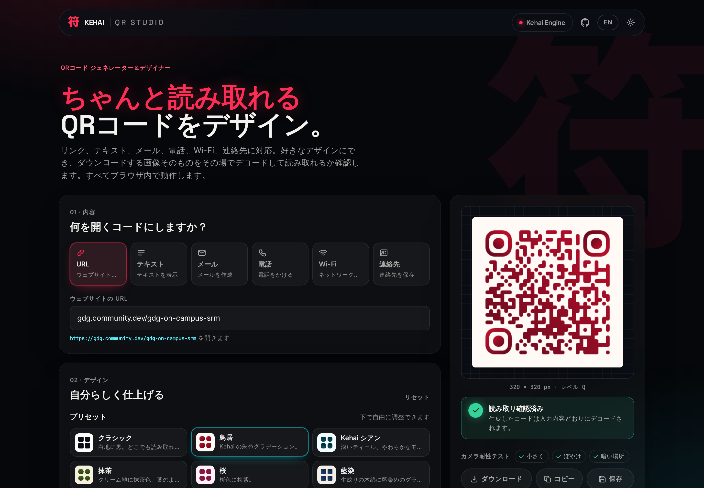

---

## なぜ作ったのか

多くの QR コード生成ツールでは色や模様を自由に選べますが、そのコードが本当に読み取れるかは、印刷して初めてわかります。
Kehai QR Studio はその確認を、作る段階で済ませます。

- 変更のたびに**描画したコードをデコード**し、意図した内容がそのまま得られるかを確かめます。
- ダウンロードの前に、**リスクのある設定を説明**します。コントラスト、色の反転、余白、誤り訂正レベルに対するロゴの大きさ、モジュールの大きさ、データの密度などです。

QR とジオフェンスを組み合わせた出席管理プラットフォーム **[Kehai Engine](https://kehai-engine-web.vercel.app)** の、小さな姉妹ツールでもあります。
2 つの役割は正反対です。
- **QR Studio** は、ポスター、Wi-Fi カード、連絡先リンクのような*固定の*コードを作ります。
- **Kehai Engine** は、*署名付きで切り替わる*コードを作り、参加者の位置情報も確認します。そのため、家にいる人にスクリーンショットを共有しても、チェックインには使えません。

単なるコードではなく「その場にいたことの証明」が必要な人のために、Studio から Kehai Engine へリンクしています。

---

## 要件チェックリスト

課題の要件すべてと、それぞれをどこで満たしているかの一覧です。

| # | 要件 | 実装 |
|---|---|---|
| 1 | **生成：** URL やテキストを入力し、リアルタイムで生成してプレビューを表示 | 1 文字入力するたびにプレビューを再描画します（`useQrRenderer`）。スキームのない URL には `https://` を付け、補足欄に最終的なリンクを表示します。 |
| 2 | **種類：** URL、テキスト、メール、電話、Wi-Fi。種類ごとに適切な入力欄を表示 | 5 種類すべてに加え、6 つ目の**連絡先**（vCard 3.0）にも対応しています。**電話番号は必須**で、名前、メール、所属、ウェブサイトは任意です。vCard には表示名が必要なため、名前がない場合は番号を名前として使います。スマートフォンでは「連絡先に追加」が表示され、RFC 2426 に沿ったエスケープを行い、名前は姓と名に分けて登録します。6 つのタブはそれぞれ自分の入力欄だけを表示します（`ContentForm`）。エンコード処理は `src/lib/qrTypes.ts` にあり、件名と本文をエンコードした `mailto:`、E.164 形式の数字に正規化した `tel:`、そして `; , : " \` を正しくエスケープする `WIFI:T:…;S:…;P:…;H:…;;` 形式に対応しています。 |
| 3 | **カスタマイズ：** サイズ、前景色・背景色、誤り訂正レベル、余白。変更は即座に反映 | サイズは 128〜1024 px、コードと背景の色（どんな色でも選べる自作のカラーピッカーと 16 進数の入力欄）、L／M／Q／H の誤り訂正レベル、そして*モジュール単位*の余白（「設計上の判断」を参照）を設定できます。どの操作もプレビューにすぐ反映されます。 |
| 4 | **プリセット：** あらかじめ用意したデザインを、選んだ後も編集可能 | プリセットは 6 種類で、そのうち 5 つは日本の色や風景がモチーフです。クラシック、鳥居（朱色）、Kehai シアン、抹茶（茶の緑）、桜、藍染。プリセットが変えるのは見た目だけで、すべての設定はその後も編集できます。プリセットから設定を変えると、パネルに「カスタム」と表示されます。 |
| 5 | **ダウンロード：** プレビューと一致する PNG | プレビューのキャンバスとダウンロードは、**同じ描画インスタンス**から作られます。ダウンロードした PNG がプレビューのキャンバスと**ピクセル単位で同一**であることを、E2E テストで確認しています。 |
| 6 | **検証：** 入力を検証し、わかりやすいエラーを表示 | 種類ごとのルールがあります。URL の形式とスキーム、メールアドレス、電話番号の桁数（3〜15 桁、`+` は先頭のみ）、Wi-Fi の SSID は 32 バイト以内、WPA は 8〜63 文字または 16 進数 64 桁、WEP は 5／13 文字または 16 進数 10／26 桁、そして各種の文字数上限です。エラーは入力欄から離れた時点で表示され、スクリーンリーダーにも読み上げられます。入力が正しくなるまで書き出しはできません。 |
| 7 | **読み取りやすさ：** 読み取れる状態を保ち、リスクのある設定を警告 | **ライブ読み取り検証**と**読み取りやすさの分析**（詳しくは後述）。 |
| 8 | **最近のコード：** ローカルに保存し、再利用でき、再読み込み後も残る | 直近 12 件のコードを、サムネイルとエディターの全状態とともに `localStorage` に保存します。クリック 1 回で種類、入力内容、デザインを復元できます。重複はまとめ、大きすぎるロゴは保存せず、容量の上限に達した場合はエラーにせず古いものから削除します。 |
| 9 | **レスポンシブ：** パソコンとスマートフォン | パソコンでは 2 カラム構成で、プレビューが追従します。プレビューが固定されるのは内容とデザインのパネルの横にある間だけで、「最近のコード」の手前で止まり、その下に潜り込むことはありません（作業用のパネルは独自のグリッド `.layout__main` を持っています）。スマートフォンでは 1 カラムになり、フォームのすぐ下にプレビューが表示されます。Pixel 7 のサイズと幅 360 px のスマートフォン（長いドメインのロゴがある場合を含む）で、横スクロールが発生しないことを確認しています。 |
| 10 | **テスト：** 種類、カスタマイズ、ダウンロード、不正な入力、保存、レスポンシブ | **114 件のユニット／コンポーネントテスト**（Vitest）と、実際の Chromium で動かす **66 件の E2E テスト**（Playwright）。[テスト](#テスト)を参照してください。 |

**任意の追加要件もすべて実装済み：** ✅ SVG でのダウンロード · ✅ 中央へのロゴ配置 · ✅ グラデーションのコード · ✅ 画像のクリップボードへのコピー（Chrome では直接、Samsung Internet では長押しの画像メニュー経由。後述） · ✅ モジュールと角の模様の変更 · ✅ ダーク／ライトテーマ

**その他の機能：** 🔗 **デザインのリンク**（後述） · 🖼️ ロゴの**ドラッグ＆ドロップや貼り付け** · ✨ URL のコードへの**ウェブサイトのロゴの自動配置**（後述） · 📤 スマートフォンでの**共有**ボタン（OS 標準の共有シート） · 🇯🇵 **English／日本語**の切り替え（後述）

### カラーピッカー

ブラウザ標準の `<input type="color">` は、ブラウザによって見た目も操作感も大きく異なります。たとえば Samsung Internet では、決まった少数の色しか選べません。そこで Studio には独自のピッカー（`src/components/ColorInput.tsx`）があり、どの端末でも同じように細かく色を選べます。

- **彩度 × 明度の四角形**と**色相のバー**で、`#rrggbb` で表せる 1,670 万色すべてを選べます。ドラッグやタップのほか、端の外までドラッグすれば最大値・最小値に届きます。正確な値は **16 進数の入力欄**に入力でき、**クイックスウォッチ**にはプリセットの色が並びます。
- **画面から色を取得**（EyeDropper API）は、対応しているブラウザ（パソコンの Chromium 系）でのみ表示されます。
- **タッチ操作が前提の設計：** ポインターキャプチャ付きのポインターイベントと `touch-action: none` により、ドラッグ中にページがスクロールすることはありません。変更はアニメーションの 1 フレームにつき 1 回にまとめるため、ドラッグ中も QR がなめらかに再描画されます。
- **キーボードとスクリーンリーダー：** どちらの操作部品も `role="slider"` で、値が読み上げられます。矢印キーで少しずつ動かせ（Shift でより大きく）、Escape で閉じてフォーカスを元に戻し、外側をクリックしても閉じます。
- 内部では HSV で扱い、保存は 16 進数で行います。灰色や黒までドラッグすると 16 進数だけでは色相を覚えておけませんが、選んだ色相は保持されます（`src/lib/color.ts`。色立方体全体を往復変換するユニットテストで確認）。
- **テスト：** E2E テストで、狙った色までのドラッグ（ダウンロードした PNG のピクセルで確認）、キーボード操作、16 進数の入力、外側クリックでの閉じる動作、スマートフォンでのタッチ操作（ページが跳ねないこと）、両テーマでの axe による監査を確認しています。

### 動きと押したときのフィードバック

- **テーマの切り替え：** 切り替えボタンから円が広がるように新しいテーマが現れます（View Transitions API、`useTheme`）。ブラウザはページのスナップショットを 1 枚入れ替えるだけなので、途中の「灰色」のフレームが表示されることはありません。API がない環境では、そのフレームだけトランジションを止めて即座に切り替えます（ゆっくりしたクロスフェードにはなりません）。太陽と月のアイコンは回転しながら現れます。
- **押せる要素すべて**（ボタン、タブ、チップ、プリセット、スウォッチ）は、押すと沈み、少し行き過ぎてから跳ね返ります。押した位置から**波紋**が広がります（`usePressRipple`：委譲した `pointerdown` リスナー 1 つで処理し、波紋の要素は自分で消えます）。
- **ブラウザのタップ時の点滅なし：** `-webkit-tap-highlight-color: transparent` により、モバイルブラウザがタップした要素に描く青や灰色の四角を消しています。ラジオボタンを使った操作部品のフォーカスリングは `:has(:focus-visible)` で表示するため、キーボード操作のときには表示され、タップの後には表示されません。
- **クリックで漢字が弾ける演出**（Kehai の象徴的な演出を、この Studio のために一から作り直したもの）：どこかをクリックすると、QR にちなんだ漢字（符 碼 読 印 紋 標 点 線 色 彩 …）が 7 つ均等に散らばり、「重力」で少し弧を描きながら回転して消えていきます。同時に、ポインターから細い輪が広がります。React の再描画を使わず、素の DOM と Web Animations API で作っており、アニメーションするのは transform と opacity だけです。描画は固定された 1 枚のオーバーレイで行い、パネルの上、通知の下に重なり、クリックを横取りすることはありません。同時に動くのは最大 4 回分です。文字の入力中、スライダーやカラーピッカーのドラッグ中、チェックボックスの操作や選択肢を選ぶとき、キーボードで操作したときは表示しません（`useKanjiBurst`）。
- **触覚フィードバック**（スマートフォン、`src/lib/haptics.ts`）：ボタン、チップ、タブ、カードを指でタップすると軽い**タップ**の振動を返します（振動するのは本当のタップのときだけです。Android の標準のボタンと同じく、スクロールに変わったタッチや、別の場所で指が離れたタッチでは振動も波紋もありません。指のときの波紋は、スクロールかどうかを見極めるために 90 ms 待ってから表示します）。スライダーやカラーピッカーをつかんだときは**グラブ**、スライダーをドラッグ中は 1 段階ごとにかすかな**ティック**（45 ms より短い間隔はまとめるため、速く動かしてもうなるような振動にはなりません）、通知と合わせて**成功**と**エラー**の振動もあります。スライダーの上を通り過ぎるスクロールでは振動せず、マウスでも振動しません。Vibration API を使っているため、Android の Chrome、Samsung Internet、Firefox で動作します。iPhone の Safari はこの API をウェブサイトに提供していないため、そこでは何もしません。ユニットテスト（振動パターン、ティックのまとめ方、API がない場合）と、実際のタッチ入力中の振動をすべて記録するスマートフォン向け E2E テストで確認しています。
- OS の**動きを減らす設定**を有効にすると、上記のアニメーションは止まります。触覚フィードバックは動きではないため、そのまま残ります。

### テキストのコードはページとして開く

実機でのテストで、テキストの QR コードに問題が見つかりました。スマートフォンの**標準カメラ**ではテキストが問題なく表示されるのに、**Google レンズでは一切表示されない**のです。Google レンズはコードを画像として扱い、メッセージの代わりに検索結果（そのバーコードにはテキストが含まれているようだ、という AI による概要）を返します。Google レンズで読み取る人は少なくありません。そこで現在は、**テキスト**のコードには既定で、そのテキストを表示する小さなページへのリンクを入れています。

```
https://kehai-qr-studio.vercel.app/t/#UHJldHRpZXN0IHNvdWwhIDwz
                                      └─ テキスト（UTF-8 → base64url）
```

- **どのカメラアプリもリンクは開ける**ため、どのスキャナーでもメッセージが表示されます。ページはシンプルで、**コピー**と**共有**のボタンがあり、リンクはタップできます。システムのライト／ダーク設定（または保存したテーマ）に従い、日本語の端末では日本語で表示されます。
- **サーバーもデータベースも使いません。** テキストは URL の**フラグメント**（`#` より後ろ）に入っており、ブラウザがこれをサーバーに送ることはありません。`/t/` は静的なページ（Vite の 2 つ目のエントリー `t/index.html` と `src/viewer/`。JavaScript は約 3 kB で、React は使っていません）で、フラグメントをブラウザ内で読み取ります。
- **悪意のある入力にも安全：** テキストは必ず `textContent` で挿入し、HTML としては扱いません。クリックできるリンクになるのは `http(s)` のリンクだけです（`rel="noopener noreferrer nofollow"` 付き）。`` を仕込んだコードを読み取り、それがテキストとして表示されて決して実行されないことを E2E テストで確認しています。
- **トレードオフは UI で説明しています：** 読み取る側にインターネット接続が必要で、コードは少し密になります（base64 によりデータ量が約 3 分の 1 増えます）。チェックボックス 1 つで**生のテキスト**に戻せます。こちらはオフラインでも使え、標準カメラでは表示されますが、Google レンズでは表示されません（チェックボックスの下の説明にもそう書いています）。この変更より前に保存した最近のコードは、生のテキストのままです。
- Service Worker はページをそれぞれのパスごとにキャッシュするため、一度訪れれば `/t/` もオフラインで動きます。

### スクロールしやすいスライダー（タッチ操作）

スマートフォンでは、ブラウザの範囲スライダーがどんなタッチも奪ってしまいます。スクロールの途中で指がスライダーに乗るとコードのサイズや余白、角度が変わってしまい、色の四角形に至ってはスクロール自体ができませんでした。現在はすべてのスライダーが、1 つのルールに従います（`src/lib/touchIntent.ts`）。

- **スライダーの上を上下にスワイプすると、ページがスクロールします。** 値は変わりません（操作部品に `touch-action: pan-y` を指定しています）。
- **はっきり横方向にドラッグ**すると値が変わります。変化は元の値からの*相対的な*量なので、指の位置に値が飛ぶことはありません。
- **短く動かさずにタップ**すると、その位置の値になります。
- **スライダーのつまみに触れると、すぐにつかめます。** カラーピッカーでは、その後どの方向にも指に追従し、指先の真下に飛ぶのではなく最初のずれを保ちます。つまみに触れるのは、明らかに操作する意図があるからです。
- **2 次元の色の四角形のそれ以外の場所**では、横方向へのドラッグか、**短い長押し**（220 ms。対応端末では小さく振動します）でつかみます。上下にスワイプするとページがスクロールします。
- **ピンチでの拡大縮小**（2 本指）は、ドラッグとしては扱いません。
- タッチ対応の端末でだけ、各範囲スライダーの上に見えないレイヤーを重ねてこのルールを適用しています。**マウスとキーボードでは標準のスライダーがそのまま動く**ため、アクセシビリティとパソコンでの挙動は変わりません。スライダーの見た目が同一であることは、ビジュアルリグレッションテストで確認しています。
- **テスト：** ジェスチャーのルールに 6 件のユニットテストがあり、さらにスマートフォン向けの E2E テストで、Chromium に*実際の*タッチ入力を送って確認しています（サイズのスライダーの上から始めたスワイプでページがスクロールし、サイズは 320 のまま。横方向のドラッグとタップでは値が変わる。色の四角形はスワイプでスクロールし、長押しでつかめる）。

### デザインのリンク

**デザインのリンクをコピー**（ダウンロードボタンの下）は、同じ種類、内容、デザインのまま Studio を開き直す URL をコピーします。チームメンバーにコードをそのまま渡して、再利用や微調整をしてもらうときに便利です。

- 状態は URL の**フラグメント**（`#d=…`。UTF-8 の JSON を URL セーフな base64 にしたもの）に詰め込むため、ブラウザがサーバーに送ることはありません。開いた後、フラグメントはアドレスバーから消えます。すでに開いているタブにリンクを貼り付けても動きます。
- **リンクは信頼できない入力として扱います**（`src/lib/shareLink.ts`）。種類は既知のものでなければならず、各項目は型が正しく文字数の上限内であること、列挙値は実際の選択肢と一致すること、数値は範囲内に収めること、色は `#rrggbb` であることを確認し、それ以外は既定値に戻します。**ロゴは決してリンクに含めない**ため、知らない人の画像が入り込むことはなく、ウェブサイトのロゴはもう一度取得し直します。
- Wi-Fi のリンクにはパスワードが含まれるため、通知でもそのことを伝えます。
- **テスト：** ユニットテストで、往復変換（UTF-8 を含む）、ロゴの除去、悪意のある内容（不正な列挙値、巨大な数値、色に仕込んだ CSS、外部のロゴの URL）を確認しています。E2E テストでは、リンクをコピーして新しいタブで開き、ダウンロードが**ピクセル単位で同一**であることを確認しています。

### English／日本語

上部バーの **日本語／EN** ボタンで、インターフェース全体が切り替わります。ラベル、補足、入力エラー、読み取りやすさの警告、読み取り検証のバッジ、通知、最近のコードの時刻、スクリーンリーダー用のラベルまですべてです。QR の**内容**は翻訳しません。コードには、入力したとおりの内容がそのまま入ります。

- **初めて訪れたとき**はブラウザの言語に従います（`ja-*` なら日本語で開始）。その後は選択を `localStorage`（`kqs.lang`）に保存し、`<html lang>` も更新するため、スクリーンリーダーや改行の処理も日本語のルールに従います。
- **多言語対応のライブラリは使っていません。** `src/i18n/` には約 40 行の翻訳関数と、英語の文そのものをキーにした辞書があります。`t("Download")` は日本語では `ダウンロード` を返し、訳がないものは英語にフォールバックします。数値やドメインは `{name}` のようなプレースホルダーで扱い、2 つの言語で語順が異なる文にリンクや太字を入れるには、小さな `rich()` ヘルパーを使います。
- **純粋なロジックは純粋なまま。** `validate()` と `analyze()` は、省略時は英語になる `t` を任意で受け取るため、ユニットテストやライブラリのコードは React なしで動きます。
- **タイポグラフィ：** 日本語の文章にはシステムの日本語フォントを使います。同梱している Noto Sans JP は、透かしに使う太い漢字だけのサブセットです。字間を広げた大文字のラベルは本文のフォントに切り替え、見出しは文節の区切りで改行します（`word-break: auto-phrase`）。
- **テスト：**
  - ユニットテストがソースコード中のすべての `t("…")` を走査し、日本語訳のない文字列、使われていない訳、プレースホルダーの食い違いがあれば失敗します。
  - E2E テストで、言語の切り替え、翻訳されたエラーと読み取り状態の表示、日本語表示で作ったダウンロードのデコード、再読み込み後も選択が残ること、`ja-JP` のブラウザが日本語で始まること、日本語の UI が幅 360 px のスマートフォンからはみ出さないこと、操作ボタン（ダウンロード · コピー · 保存）が 1 行に収まり英語表示と同じ高さであることを確認しています。ダウンロードはほかの 2 つの約 2 倍の幅があるため、日本語表示では広めの列を割り当てています。

### ダウンロード：画像かベクターか

書き出し用のボタンは 2×2 のグリッドで、**ダウンロード · コピー／共有 · 保存** が並びます。共有が使えないパソコンでは、3 つが 1 列に並びます。**ダウンロード**では形式を尋ねるため、ギャラリーに表示できないファイルを受け取ってしまうことはありません。

- **画像（PNG）**（おすすめ）：輪郭が完全にくっきりしていて、写真と一緒に表示されます。**JPG は選べません。** 圧縮によって四角がにじみ、読み取りに悪影響が出ることがあるためです。
- **ベクター（SVG）**：デザイナー向けで、どんなサイズでも印刷できます。写真のギャラリーには表示されないことを明記しています。

きちんとしたメニューとして作っています。フォーカスは最初の選択肢に移り、矢印キーで選択肢を移動でき、Escape か外側のクリックで閉じ、フォーカスはボタンに戻ります。

### 通知

メッセージは、画面下部にコンパクトなカードとして、スマートフォンのジェスチャーバーにかからない位置に表示されます。成功・情報・エラーの色付きアイコン、きれいに折り返す左揃えのテキスト、閉じるための × があります。長いメッセージほど長く表示します（1 文字あたり約 55 ms、最短 3.2 秒）。以前の完全に丸い「ピル」型では、長いメッセージがスマートフォンで読みにくい楕円に押し込まれていたため、この形に変えました。

### ブラウザをまたいだコピーと共有

ブラウザがクリップボードへの書き込みを許可するのは、**クリックの処理中だけ**です。
- Studio はクリップボードへの書き込みをすぐに開始し、画像は描画が終わると解決される *Promise* として渡します。Samsung Internet や Safari のような厳しいエンジンでは、ページが先に画像を待つと書き込みを拒否されるためです。
- Promise を受け取れないエンジンでは、完成した画像で再試行します。
- 画像のコピーを一切受け付けないモバイルブラウザもあります。その場合、**コピーは OS 標準の共有シートにフォールバック**し、そこからワンタップでコピーしたり、任意のアプリに送ったりできます。どちらも使えないブラウザでは、「代わりにダウンロードしてください」というわかりやすいメッセージを表示します。
- ファイルを共有できる端末では、別の**共有**ボタンから PNG を WhatsApp や Google ドライブなどに直接送れます。共有したコードも、ダウンロードと同じく「最近のコード」に保存されます。

> **Samsung Internet について。** 実際の Galaxy では、クリップボード API が画像を受け取らず、エラーさえ出ないこともありました。そのため、（Chromium でしか検証していなかった）以前の修正は効果がありませんでした。現在は、Samsung Internet でのコピーを別の方法で扱っています。
> - **Samsung Internet ではクリップボード API を使いません。** コードを強調表示し、「QR コードを長押ししてコピーまたは保存するか、共有を使ってください」と案内します。
> - **長押しが使える理由：** プレビューには、ダウンロードされる PNG とまったく同じ画像の見えない `` が重ねてあります（タッチ対応の端末のみなので、見た目は変わりません）。これを長押しすると、ブラウザ**自身**の画像メニューが開き、コピーや保存をブラウザの標準機能で行えます。
> - **すべてのブラウザで**、クリップボードへの書き込みには 2.5 秒の制限時間があるため、応答のない書き込みでボタンが無反応になることはなく、共有シートにフォールバックします。`ClipboardItem.supports()` がある環境では、先にそれで確認します。
> - **診断：** サイトを `?debug` 付きで開くと、コピーに失敗したときのエラーの経緯がメッセージに表示されます。例：`[write(promise): TimeoutError → write(blob): NotAllowedError]`
>
> 長押しによる方法は、実際の Galaxy での確認がまだ残っています。

---

## ウェブサイトのロゴを自動で配置

リンクを貼り付けると、Studio がそのウェブサイトのロゴを探してコードの中央に配置します。追加の操作は必要ありません。

<p align="center">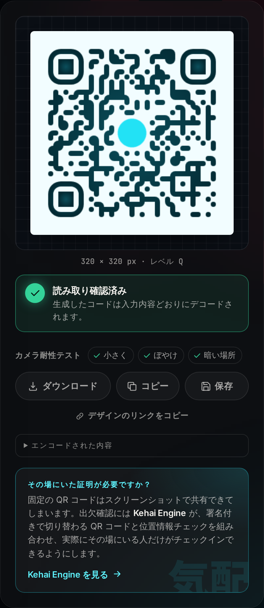 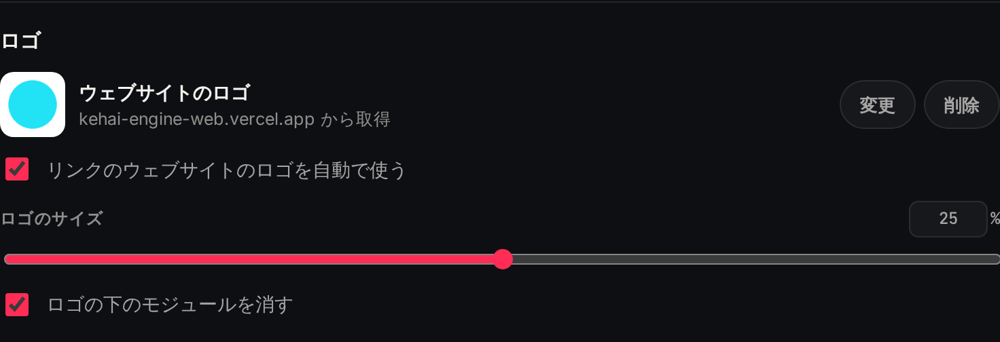</p>

**仕組み**（`src/lib/siteLogo.ts`、`src/hooks/useSiteLogo.ts`）：

1. **リンクの入力が落ち着くのを待つ。** URL が正しく、入力が止まったら（700 ms）、そのドメイン（例：`gdg.community.dev`）を取り出します。
2. **公開されているファビコンサービスにアイコンを尋ねる。** ブラウザはほかのサイトの HTML を読めず（CORS）、バックエンドもないため、Google のファビコンサービス、icon.horse、DuckDuckGo の順に問い合わせます。**送るのはドメインだけ**で、パスやクエリは送りません。
3. **安全でくっきりした画像だけを使う。** 画像を使うのは、次の条件をすべて満たす場合だけです。
   - **CORS ヘッダー付き**で届くこと（そうでないと、描画したときにキャンバスが汚染され、ダウンロードと読み取りチェックが壊れます）
   - 本物の画像であること
   - **32 px 以上**であること（小さなファビコンは、拡大するとぼやけて見えます）
4. **ローカルに保存する。** 256 px のキャンバスに描き直して **data: URL** として保存するため、書き出しや保存した履歴が、その後ネットワークに頼ることはありません。各ドメインの検索は、1 回の訪問につき 1 度だけです。
5. **読み取れる状態を保つ。** ロゴを追加すると、アップロードしたロゴと同じく誤り訂正レベルを **H** に上げ、ライブ読み取りチェックで結果を確認します。

**主導権はいつもユーザーにあります：**

- **削除：** そのサイトではロゴを付けないままにし、ワンクリックの「**元に戻す**」で再び付けられます。
- **差し替え：** 自分のロゴをアップロードできます。アップロードしたロゴは常に優先され、自動検索で上書きされることはありません。
- **サイトや種類を変える：** 別のサイトにすればそのサイトのロゴに替わり、URL 以外の種類に切り替えるとロゴは外れます。
- **機能をオフにする：** 「リンクのウェブサイトのロゴを自動で使う」の切り替えは、次回以降も記憶されます。オフにすると、検索は一切行いません。
- **失敗しても静かに：** 適切な画像が見つからなければロゴなしでコードを作り、パネルでそのことを伝えます。

---

### レイアウトの修正：ロゴの行の長いドメイン

幅の狭いスマートフォン（約 360 px）では、長いドメイン（例：`kotoba-connect-three.vercel.app`）のロゴが見つかると、デザインパネル全体が右端からはみ出していました（プリセット、スライダー、入力欄が切れていました）。原因は、ロゴの行にある差し替え／削除のボタンが縮まなかったことと、グリッドやフレックスの子要素が既定で `min-width: auto` であるため、その行がパネルを画面より広く押し広げていたことです。修正として、行を折り返し可能にし、ドメインの文字列はどこでも折り返せるようにし、パネルとレイアウトのセルに `min-width: 0` を指定しました。幅 360 px での Playwright のテストで、再発を防いでいます。

## 読み取りやすさの詳細

### 1. ライブ読み取り検証

何かを変更してから約 250 ms 後に、Studio は 3 つの処理を行います（`useScanCheck`、`src/lib/scanCheck.ts`）。
1. ダウンロードされるのと同じ PNG を描画します。
2. [jsQR](https://github.com/cozmo/jsQR) でデコードします。
3. デコードしたバイト列を、意図した内容と比較します。

デコードは、まずどのスキャナーでも読める通常の極性（明るい背景に暗いコード）で行います。失敗した場合は、色を反転してもう一度試します。反転したときだけデコードできるコード（暗い背景に明るいコード）は「**最近のアプリでのみ読み取り可能**」と表示します。これは失敗ではなく注意点です。Google レンズや最近のスマートフォンのカメラの多くは色を反転して再試行しますが、古いスキャナーアプリの中にはそうしないものもあるからです。以前のバージョンでは反転しての再試行を行わず、そうしたコードを「読み取れません」と表示していましたが、実機でのテストで、バッジが「読み取れません」と判定した赤と黒のコードを Google レンズが読み取れることがわかり、改めました。（jsQR 自体の `onlyInvert` モードはクラッシュするため、Studio が自分でピクセルを反転しています。実際の暗い背景に明るいコードを使ったユニットテストで確認しています。）

| バッジ | 意味 |
|---|---|
| ✅ **読み取り確認済み** | 入力した内容どおりにデコードでき、読み取りやすさのルールにも引っかからない |
| ⚠️ **読み取れます（注意点あり）** | 正しくデコードできるが、実際のカメラ向けの経験則に反するデザインがある |
| ⚠️ **最近のアプリでのみ読み取り可能** | 色を反転したときだけデコードできる（暗い背景に明るいコード）。Google レンズや最近のスマートフォンのカメラの多くは読めるが、古いスキャナーアプリには読めないものもある |
| ❌ **読み取れません**／**違う内容にデコードされます** | 描画した画像がデコードできない、または別の内容にデコードされる |

### 1b. カメラ耐性テスト

デジタルの画像を完璧にデコードできれば、データが正しいことは証明できます。しかし、スマートフォンのカメラの条件はもっと厳しいものです。そこで、コードをデコードできたら、さらにカメラの撮影条件を模した 3 つの状態でデコードし、結果をバッジの下にチップとして表示します。

- **小さく：** 120 px に縮小。小さな印刷物を少し離れて写すイメージ
- **ぼやけ：** 240 px で 1.2 px のぼかし（ピント外れや手ぶれ）
- **暗い場所：** 240 px でコントラストを灰色寄りに押しつぶした状態

6 つのプリセットはすべて、3 つとも合格します。白地に灰色のコードは「暗い場所」で、320 px の 400 文字のテキストは「小さく」で不合格になります。どちらもデジタルでは完璧にデコードできるにもかかわらずです。このチェックが明らかにしたいのは、まさにこの差です（E2E テストで確認）。この処理は、遅延読み込みするデコーダーのチャンクの中で動きます。

**障害の切り離し：** チェックそのものが動かない場合（デコーダーの読み込みに失敗した、キャンバスが使えないなど）、バッジは「読み取れません」ではなく「*読み取りチェックを実行できませんでした*」と表示します。壊れた道具が、良いコードに不合格を言い渡してはならないからです。カメラ耐性テストはあくまで追加の確認なので、一部のブラウザで失敗しても、チップが表示されないだけで、確認済みの結果はそのまま残ります。デコーダーをモックしたユニットテストで確認しています。

**テキストとカメラアプリ：** 正しい生のテキストのコードでも、「読み取れなかった」ように見えることがあります。実機でのテストでは、スマートフォンの**標準カメラ**で読み取るとテキストが表示されましたが、**Google レンズ**では表示されず、代わりに画像検索の結果（「テキストを含むバーコード」についての AI による概要）が返されました。コード自体は jsQR でも ZXing でも正しくデコードできます。そのため、テキストのコードは既定でページとして開くようにし（前述）、生のテキストを選んだときには、テキストのタブでそのトレードオフを説明しています。

### 2. 読み取りやすさの分析

完璧なデジタル画像を読むデコーダーは、暗い場所で斜めから写すスマートフォンのカメラよりも、ずっと寛容です。
そこで `src/lib/readability.ts` では、静的なルールもあわせて適用し、それぞれにわかりやすい改善方法を示します。

| チェック | ルール |
|---|---|
| コントラスト | コードと背景の WCAG コントラスト比。2:1 未満はエラー、4:1 未満は警告。グラデーションの場合は両端を確認し、弱いほうで判定します。 |
| 色の反転 | 背景より明るいコードは警告です。色を反転して試すアプリでしか読み取れません（Google レンズや最近のスマートフォンのカメラの多くは試しますが、古いスキャナーアプリの中には試さないものもあります）。 |
| 余白（クワイエットゾーン） | 余白は、実際に描画されたモジュール数で測ります。1 未満はエラー、2 未満は警告。 |
| モジュールの大きさ | 1 モジュールあたりのピクセル数。2 px 未満はエラー、3 px 未満は警告。 |
| ロゴと誤り訂正 | ロゴの面積を、そのレベルで復元できる割合（L 7%、M 15%、Q 25%、H 30%）と比べます。ロゴを追加すると、レベルは自動で **H** に上がります。 |
| 装飾的なモジュール | 「ドット」「クラッシー」の模様をレベル L や M で使うと、Q か H を使うよう警告します。 |
| 密度／容量超過 | 非常に密なコード（バージョン 15 以上）には警告を出します。どのバージョンにも収まらない長さの内容は、クラッシュさせずにその旨を伝えます。 |

<p align="center">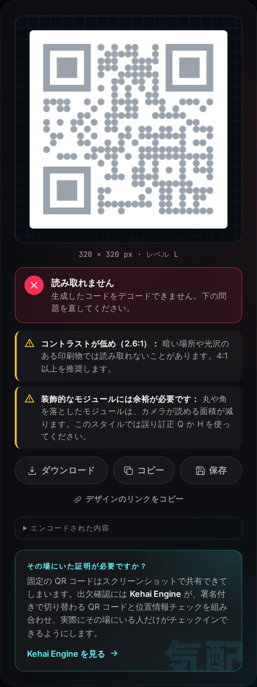</p>

---

## スクリーンショット

| ライトテーマ · Wi-Fi | ロゴ + グラデーション |
|---|---|
| 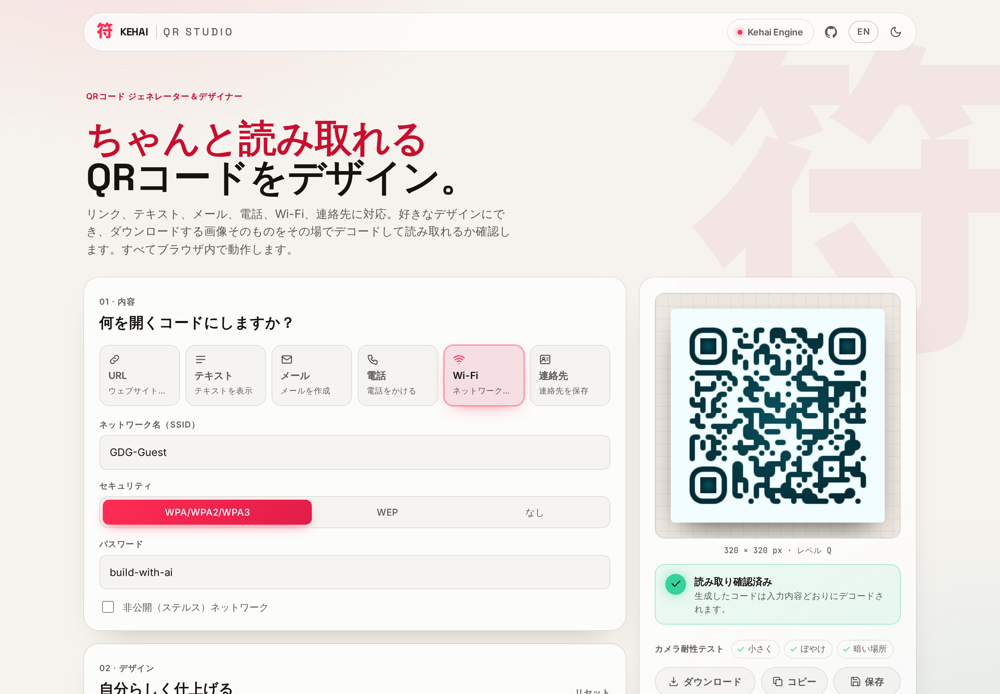 | 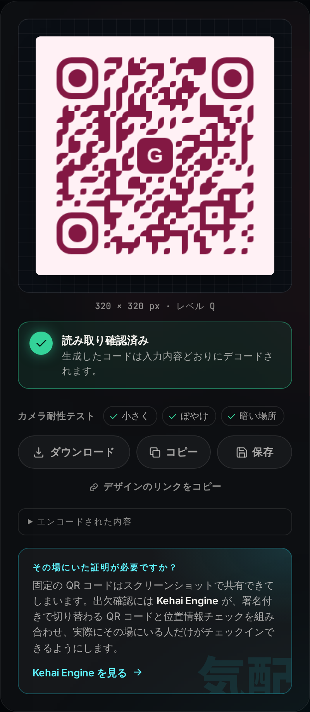 |

| デザインパネル | 入力の検証 |
|---|---|
| 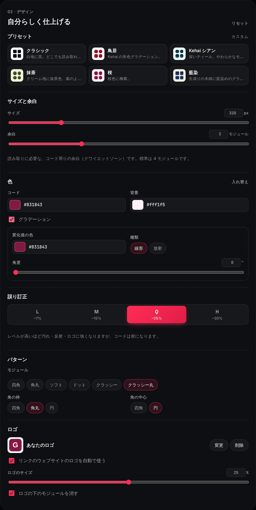 | 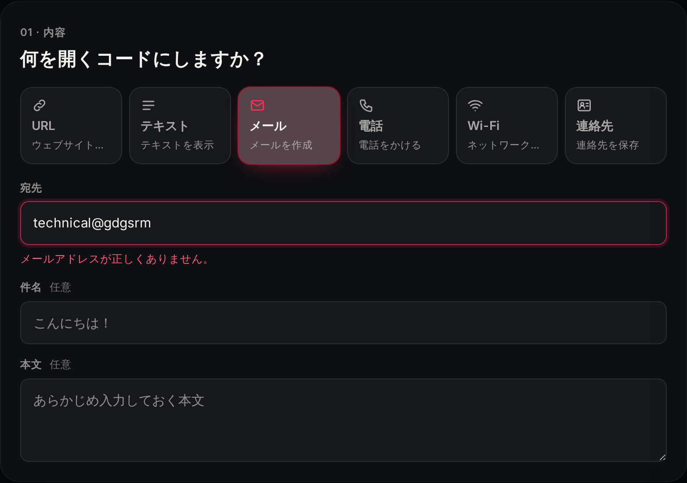 |

| スマートフォン | スマートフォンのプレビュー |
|---|---|
| 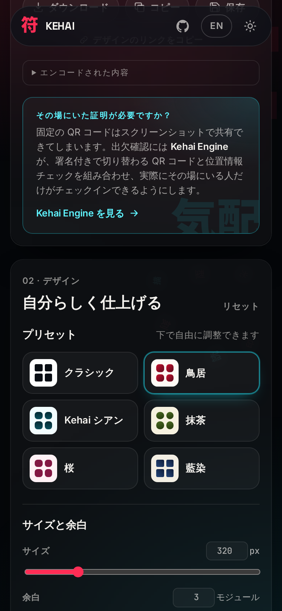 | 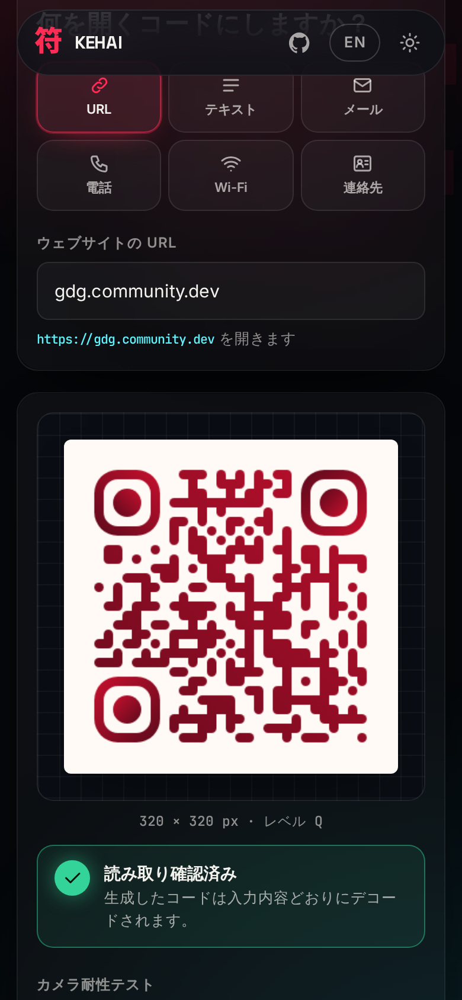 |

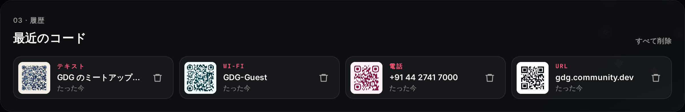

---

## アーキテクチャ

```
src/
├── lib/                    純粋なロジック：React を使わず、すべてユニットテスト済み
│   ├── qrTypes.ts          種類、入力項目、検証、エンコード（URL／テキスト／メール／電話／Wi-Fi）
│   ├── design.ts           デザインのモデル、プリセット、モジュール単位の余白、qr-code-styling のオプション
│   ├── readability.ts      コントラストの計算、ジオメトリ、読み取りやすさのルール
│   ├── scanCheck.ts        描画したピクセルを jsQR でデコードし、内容と比較
│   ├── history.ts          最近のコードの保存（検証、重複の除去、容量超過への対応）
│   ├── siteLogo.ts         ウェブサイトのロゴの検索：ドメインの抽出、ファビコンサービス、CORS とサイズの確認
│   └── exporting.ts        ダウンロード、クリップボード、サムネイル、ファイル名
├── hooks/
│   ├── useQrRenderer.ts    唯一の描画インスタンスを管理（プレビュー = 書き出し）
│   ├── useScanCheck.ts     デバウンスしたライブ検証
│   ├── useRecent.ts        履歴の状態（タブ間で同期）
│   ├── useSiteLogo.ts      リンクのウェブサイトのロゴの自動追加・削除、削除／復元／切り替え
│   └── useTheme.ts         ダーク／ライトテーマ（保存あり、読み込み時のちらつきなし）
├── i18n/
│   ├── i18n.ts             翻訳関数（英語の文をキーに、{プレースホルダー}）、言語の判定
│   ├── ja.ts               日本語の辞書
│   └── I18nContext.tsx     言語の状態とコンテキスト、インラインの装飾用の rich()
├── components/             ContentForm、DesignPanel、Preview、RecentList、KehaiCallout など
└── App.tsx                 状態の配線
t/index.html, src/viewer/    テキストのコードのメッセージを表示する /t/ のページ（素の DOM、約 3 kB）
e2e/                        Playwright：動作、レスポンシブなレイアウト、README 用のスクリーンショット
```

**データの流れ：** `fields → validate() → encode() → payload` の後、`payload + design` が 3 つのものに渡ります。**描画**（プレビューと書き出し）、**analyze()**（警告）、**verifyScan()**（バッジ）です。
デザインの情報源は 1 つだけなので、プレビュー、ダウンロードした PNG、SVG がずれることはありません。

**バンドルの分割。** 初回の読み込みに必要なのは、React、描画ライブラリ、アプリ本体です（gzip 後で約 103 kB）。jsQR のデコーダー（gzip 後で約 48 kB）は読み取りのバッジにしか使わないため、別のチャンクにして、最初の描画と並行して取得します（`useScanCheck`）。React と描画ライブラリも別のチャンクにしているため、アプリのコードを再デプロイしても、これらを再ダウンロードする必要はありません。この分割を導入したときは、初回の読み込みが gzip 後で 141 kB から 91 kB に減りました。その後に追加した機能（日本語、カラーピッカー、デザインのリンク、カメラ耐性テストなど）で現在は約 103 kB ですが、デコーダーは引き続き初回の読み込みから外しています。

**すりガラスの見た目を残したまま、なめらかなスクロールに（測定済み）。** 実機でのテストで、スクロール中に小さなカクつきが見られました。原因は、4 つの大きなパネルにかけていた `backdrop-filter: blur()` でした。背景は `position: fixed` なのでパネルに対して動き、ブラウザはフレームごとに、すべてのパネルの背後をぼかし直していました。ぼかしを小さくしたりレイヤーを分けたりしても十分な効果はなく（最善でも約 49 fps）、効果をなくすという選択肢もなかったため、ぼかしは**一度だけ焼き込む**方式にしました。

- `useFrost` が、ページの背景（両方の光彩と大きな「符」）を、ぼかした状態で小さなキャンバスに描きます。描くのは読み込み時で、**両方のテーマ**の分を用意します。描き直すのはビューポートの*幅*が変わったときだけで、スクロール中には描き直しません（モバイルの URL バーはスクロール中に高さを変えるためです）。
- **フリックしても黒いブロックが出ない（スマートフォン）。** 原因は 2 つあり、どちらも、完成したフレームのピクセルを 1 つも変えずに直しました。
  - *アドレスバー。* 背景**と**すりガラスのレイヤーを、最も大きいビューポートの高さ（`100lvh`）にし、焼き込んだ画像をその全体に引き伸ばしています（`100% 100%`）。スクロール中にアドレスバーが引っ込むと画面が高くなり、以前はまずすりガラスが、次に背景が下端で途切れていました。ぼかしがあるので、引き伸ばしは目に見えません。
  - *遅れて届くタイル。* Chrome はレイヤーをタイル単位でラスタライズし、まだ準備できていないタイルはそのレイヤーの**背景色**で塗ります。すりガラスのレイヤーはスクロールのたびに動くクリップの下にあるため、パネルが画面に入ってくるたびにタイルの再ラスタライズが必要になり（測定では、スクロール中のラスタライズの処理がすりガラスによって約 2 倍に増えていました）、速くフリックすると間に合わないことがあります。その背景色がほぼ黒の `--bg` だったため、遅れたタイルが黒いブロックとして見えていました。現在はすりガラスのレイヤーに**背景色を指定していない**ため（焼き込んだ画像は端まで完全に不透明です）、遅れたタイルからは、ほぼ同じ見た目のくっきりした背景が透けて見えるだけです。
  - 再発防止（スマートフォン向け E2E）：ビューポートが広がった後も背景とすりガラスが下端まで届いていること、すりガラスのレイヤーの背景色が透明であること、焼き込んだ画像の最小のアルファ値が 255 であること。（最後のチェックで、丸め誤差のために画像の一番下の行が 75% しか不透明でなかったことが見つかりました。以前は背景色がそれを隠していました。）
- 各パネルには `<Glass>` が入っています。これはその画像を表示する `position: fixed` のレイヤーで、実際の背景と位置を合わせ、`clip-path: inset(0 round r)` でパネルの形に切り抜いています。スクロール中、コンポジターはテクスチャの上でクリップを動かすだけで、フレームごとのぼかし処理はありません。
- 結果は、ぼかしをリアルタイムでかけていたときと見た目が同一です（両テーマのスクリーンショットを並べて確認）。小さな上部バーだけは負荷が小さいため、本物のぼかしを残しています。固定された背景は、独自のコンポジターレイヤーに載っています。

幅 412 px のページを、CPU を 4 倍遅くした状態でスクロールして測定しました（`requestAnimationFrame` によるフレーム時間、各 3 回）。

| | fps | カクついたフレーム（25 ms 超） | 最も遅いフレーム |
|---|---|---|---|
| パネルにリアルタイムの `backdrop-filter` | 約 43 | 116 中 約 40 | 50 ms |
| ぼかしの半径を小さく（6 px） | 約 49 | 116 中 約 24 | — |
| **焼き込んだすりガラス** | **60** | **0** | 17 ms |

再発防止（E2E）：リアルタイムの背景ぼかしを使ってよいのは上部バーだけであること、`<Glass>` を持つパネルはすべて位置指定されたボックスであること（そうでないと固定のレイヤーがはみ出してページを覆ってしまいます。この仕組みを作る途中で実際に見つかった不具合です）、焼き込んだ画像が両方のテーマについて存在すること。

**オフラインで動作。** 手書きの小さな Service Worker（`public/sw.js`）が、ページはネットワーク優先（オフラインならキャッシュを使用）、ハッシュ付きの `/assets/*` のファイルはキャッシュ優先（古くなることがありません）で返します。別オリジンへのリクエストには一切触れません。一度訪れれば、読み取りチェックやダウンロードも含めて Studio 全体がオフラインで動き、Web マニフェストによってホーム画面にインストールすることもできます。ネットワークを切った状態で再読み込みし、コードを作ってダウンロードしたものをデコードする E2E テストで確認しています。

**バックエンドなし。** すべてがブラウザ内で動きます。フォントは Google Fonts から読み込まずに同梱し、アプリが実際に使う 3 つの漢字のサブセットだけを配信しています。外部への**唯一の**リクエストは、任意のウェブサイトのロゴの検索です。リンクのドメイン名を公開のファビコンサービスに送るもので、オフにすることもできます。

---

## 設計上の判断

- **余白はピクセルではなくモジュール単位。** QR のスキャナーには、モジュール単位で測る「クワイエットゾーン」が必要です（仕様では 4 モジュール）。320 px では問題のないピクセル単位の余白も、1024 px では消えてしまい、テストでそれが見つかりました。余白の設定はモジュール単位で行い、コードの実際のグリッドからピクセルに換算するため、どのサイズでも正しくなります。
- **きちんと動く UTF-8。** 描画ライブラリは 1 文字を 1 バイトとして書き込むため、アクセント記号、漢字、絵文字が壊れてしまいます。そこで内容を先に UTF-8 のバイト列に変換しています。`こんにちは 🌸` を使った E2E テストがあります。
- **エラーは操作の後に。** 入力エラーのメッセージは、最初の 1 文字を入力している最中ではなく、入力欄から離れたときに表示します。入力が正しくなるまで書き出しはできません。
- **プリセットが変えるのは見た目だけ。** プリセットを変えてもサイズとロゴはそのまま残り、その後もすべて調整できます。
- **ちゃんと入力できる数値ボックス。** サイズ、余白、角度、ロゴのサイズのボックスは、範囲内の値になった時点ですぐ反映しますが、範囲外の途中の値（「256」を入力する途中の「2」など）は入力どおりに保ち、ボックスから離れるか Enter を押したときにだけ範囲内に収めます。以前は最初のキー入力で最小値に変わってしまい、サイズを入力できませんでした（ユニットテストで確認）。
- **監査済みのアクセシビリティ：** E2E テストの中で、WCAG 2.1 A／AA を基準に [axe-core](https://github.com/dequelabs/axe-core) による自動監査を、両テーマ・両言語、そして情報の多い画面（警告、ウェブサイトのロゴ、最近のコードが表示された状態）に対して実行しています。最初の実行で補足的な文字のコントラストが 4.5:1 を下回っていることが見つかり、両テーマで `--text-3` の色を引き上げました。現在、違反はゼロです。
- **アクセシビリティ：** すべての選択肢に標準のラジオグループを使用（キーボードとスクリーンリーダーに対応）、ラベル付きの操作部品、エラーには `aria-invalid`／`aria-describedby`、読み取りのバッジと通知にはライブリージョン、見えるフォーカスリング、動きを減らす設定への対応。

---

## はじめに

```bash
npm install
npm run dev          # http://localhost:5173
npm run build        # 型チェック + dist/ への本番ビルド
npm run preview      # 本番ビルドを配信
```

Node 18 以上が必要です。

### テスト

```bash
npm test             # 114 件のユニット + コンポーネントテスト（Vitest、jsdom）
npm run test:e2e     # Chromium での 66 件の E2E テスト（パソコン + Pixel 7）
npm run screenshots  # README 用のスクリーンショット（英語版と、日本語表示の docs/screenshots/ja）を再生成
npm run test:visual:docker  # 承認済みの見た目とのピクセル比較（14 枚のスクリーンショット、Docker 内で実行）
```

**ビジュアルリグレッションテスト（`npm run test:visual`）。** 承認済みの見た目を、14 枚の基準スクリーンショット（スマートフォンとパソコン、ダークとライト、複数のスクロール位置）として `e2e/visual.spec.ts-snapshots/` に保存しています。2% の色の許容差を超えて変化したピクセルが 50 を超えると、テストは失敗します。パネルの角の丸みを意図的に 2 px 変えると検出されます（223 ピクセル）。このテストは **push のたびに CI で**、Playwright 公式の Docker イメージ（`mcr.microsoft.com/playwright:v1.56.1-noble`）の中で実行し、基準のスクリーンショットも同じイメージの中で作っています。マシンが違うと文字の描画がごくわずかに異なるため（たとえば「日本語」の表示に使われるシステムフォント）、あるコンピューターで作った基準を別のコンピューターで確認すると、何も変わっていなくても約 1% の「偽の」差分で失敗していました。基準の作成と確認を同じコンテナで行うことでその問題がなくなり、本当にデザインが変わったときだけ失敗するようになりました。（この修正は、LinkedIn でもらった読者の提案がきっかけです。）Playwright のバージョンと Docker イメージがずれた場合に失敗する CI のステップもあり、テストが失敗したときは差分の画像をアップロードします。
- ローカルで確認する（Docker が必要）：`npm run test:visual:docker`
- 見た目の変更を承認した後：`npm run test:visual:update` を実行し、新しいスクリーンショットをコミットします。

どちらのコマンドも依存関係をコンテナ内の専用ボリュームにインストールするため、ローカルの `node_modules` には影響せず、Windows、macOS、Linux のどれからでも動きます。

E2E テストが実際のブラウザで確認している内容：

- **すべての種類**（URL、UTF-8 や絵文字を含むテキスト、メール、電話、特殊文字を含む Wi-Fi、vCard の連絡先）を PNG でダウンロードし、**2 つの独立したデコーダーで元の内容どおりにデコードできる**こと：jsQR と、ZXing（`zxing-wasm` 経由の zxing-cpp。多くの Android のスキャナーアプリが使うエンジン）
- **ダウンロードした PNG がプレビューとピクセル単位で同一**であること
- **サイズ、色、誤り訂正レベル、余白**の変更がすぐ出力に反映されること。サイズと色は、ダウンロードしたファイル自体で確認します。
- **プリセット**が適用され、その後も編集できること。**不正な入力**ではエラーが表示され、書き出しができないこと。**リスクのあるデザイン**では警告が出ること。
- **ロゴ**を追加すると誤り訂正レベルが上がり、それでも読み取れること。ロゴはアップロード、**ロゴの欄へのドラッグ**、ページのどこへでも**貼り付け**（スクリーンショットなど）で追加できること。**SVG の書き出し**が正しい SVG 文書であること。
- **最近のコードが再読み込み後も残り**、種類、内容、プリセットを復元できること。削除と全消去が動くこと。
- ダーク／ライト × 英語／日本語で、axe-core による **WCAG 2.1 AA の違反がゼロ**であること。情報の多い画面での監査も行います。
- **オフライン：** 一度訪れた後は、ネットワークなしで再読み込みしても、コードの作成、検証、ダウンロードができること。
- **テーマ**と**言語**の選択が保存され、日本語の UI が最初から最後まで動くこと。**スマートフォン**では横スクロールがなく、プレビューがフォームの下に表示され、すべてのタブに届くこと。
- **ウェブサイトのロゴ：** ファビコンサービスは生成した画像でスタブ化しているため、テストがインターネットに依存することはありません。確認している内容：
  - リンクにそのサイトのロゴが自動で付き（ダウンロードした画像の中央のピクセルで確認）、コードが引き続きデコードできること
  - 送られるのはドメインだけであること
  - 削除、「元に戻す」、アップロード／差し替えが動き、アップロードしたロゴが上書きされないこと
  - 別のサイトにするとロゴが替わり、URL 以外の種類にするとロゴが外れること
  - アイコンがない、または小さすぎる場合はロゴを付けないこと
  - オフの設定が記憶され、その間はリクエストを一切行わないこと
- **コピーと共有：**
  - コピーで、まったく同じ PNG がクリップボードに入ること。読み戻してデコードして確認します。
  - ブラウザが画像のコピーを拒否する場合（シミュレーション）、コピーが代わりに PNG 付きの共有シートを開くこと。
  - 共有ボタンはファイル共有に対応した環境でだけ表示され、デコードできる PNG を共有すること。
- **正直な読み取りバッジ：** 暗い背景に明るいコード（黒地に赤、レベル L。実機で起きたケース）が「読み取れません」ではなく「最近のアプリでのみ読み取り可能」と表示され、ZXing でダウンロードした画像をデコードできること。
- **触覚フィードバック：** スマートフォンのプロファイルで、実際のタッチ入力中のすべての振動を記録します。ボタンの上から始めたスワイプはページをスクロールし、振動も波紋もないこと。そのボタンをタップすると 1 回振動すること。プリセットのタップで 1 回振動し、スライダーのドラッグではグラブの後に軽いティックが続き、スライダーの上を通り過ぎるスクロールでは振動せず、ダウンロードで成功のパターンが出ること。パソコンでは、マウスのクリックで決して振動しないこと。
- **スマートフォンで黒いブロックが出ない：** アドレスバーが引っ込んでも背景とすりガラスが下端まで届き、すりガラスのレイヤーに背景色がなく、焼き込んだすりガラスの画像が完全に不透明であること。

---

## デプロイ

静的なサイトです。Vercel では、リポジトリをインポートし、自動で検出される **Vite** のプリセット（ビルドは `npm run build`、出力先は `dist`）のままデプロイします。Netlify でも同じようにデプロイできます。

---

## クレジット

- 描画には [qr-code-styling](https://github.com/kozakdenys/qr-code-styling)（MIT）、モジュールのジオメトリには [qrcode-generator](https://github.com/kazuhikoarase/qrcode-generator)（MIT）
- デコードには [jsQR](https://github.com/cozmo/jsQR)（Apache-2.0）
- フォントは Inter、Space Grotesk、JetBrains Mono、Noto Sans JP（SIL OFL 1.1）を Fontsource 経由で使用

GDG on Campus SRM の技術系採用課題（Frontend Task 1）として、Kehai エコシステムの一部として **[Sushil Raj](https://github.com/SushilRaj0177)** が制作しました。
