<div align="center">

# 符 Kehai QR Studio

**Design QR codes that actually scan.**

A browser-only QR code generator and designer for links, text, email, phone numbers and Wi-Fi.
It verifies every design live by decoding the exact image you're about to download, and puts a link's own website logo in the centre automatically.

**[Live demo → kehai-qr-studio.vercel.app](https://kehai-qr-studio.vercel.app)**

React · TypeScript · Vite · qr-code-styling · jsQR · Vitest · Playwright

</div>

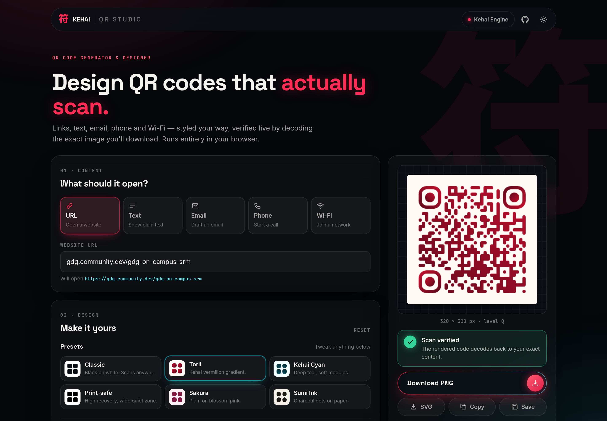

---

## Why this exists

Most QR generators let you pick colours and patterns, then leave you to find out at the printer that the code doesn't scan.
Kehai QR Studio closes that loop:

- It **decodes the rendered code** after every change and checks that it returns exactly what you meant to encode.
- It **explains risky choices** before you download: contrast, inverted colours, margins, logo size versus error correction, module size, data density.

It's a small sibling of **[Kehai Engine](https://kehai-engine-web.vercel.app)**, a QR + geofence attendance platform.
The two do opposite jobs:
- **QR Studio** makes *static* codes: posters, Wi-Fi cards, contact links.
- **Kehai Engine** makes *signed, rotating* codes that also check the attendee's location, so a screenshot shared to someone at home can't be used to check in.

The Studio links there for anyone who needs proof of presence rather than just a code.

---

## Requirements checklist

Every point from the task brief, and where it's handled.

| # | Requirement | Implementation |
|---|---|---|
| 1 | **Generation:** enter a URL or text, generate in real time, show a preview | The preview re-renders on every keystroke (`useQrRenderer`). URLs without a scheme get `https://` added, and the hint shows the final link. |
| 2 | **Types:** URL, plain text, email, phone, Wi-Fi, with the right inputs per type | Five type tabs, each showing only its own fields (`ContentForm`). Encoders in `src/lib/qrTypes.ts`: `mailto:` with encoded subject/body, `tel:` normalised to E.164 digits, and the `WIFI:T:…;S:…;P:…;H:…;;` format with correct escaping of `; , : " \`. |
| 3 | **Customisation:** size, foreground/background, error correction, margin, instant updates | Size 128–1024 px, code and background colours (picker + hex), L/M/Q/H error correction, and margin in *modules* (see design decisions). Every control updates the preview immediately. |
| 4 | **Presets:** predefined visual presets, editable afterwards | Six presets (Classic, Torii, Kehai Cyan, Print-safe, Sakura, Sumi Ink). A preset only sets appearance and every control stays editable. The panel shows when you've drifted to "Custom". |
| 5 | **Download:** PNG that matches the preview | The preview canvas and the download come from the **same renderer instance**. An end-to-end test asserts the downloaded PNG is **pixel-identical** to the preview canvas. |
| 6 | **Validation:** validate input, show clear errors | Per-type rules: URL shape and scheme, email address, phone digits (3–15, `+` only at the start), Wi-Fi SSID ≤ 32 bytes, WPA 8–63 chars or 64-hex, WEP 5/13 chars or 10/26 hex, length caps. Errors appear once a field is left, are announced to screen readers, and export stays disabled until the input is valid. |
| 7 | **Scan reliability:** keep codes scannable, warn about risky choices | **Live scan verification** plus **readability analysis** (details below). |
| 8 | **Recent codes:** stored locally, reusable, survive a refresh | The last 12 codes are saved in `localStorage` with a thumbnail and the full editor state. One click restores the type, fields and design. Duplicates are merged, oversized logos are dropped, and quota errors trim the oldest entries instead of failing. |
| 9 | **Responsive:** desktop and mobile | Two-column studio with a sticky preview on desktop. On phones it's a single column with the preview right under the form. Tested at Pixel 7 size with no horizontal scroll. |
| 10 | **Testing:** types, customisation, downloads, invalid input, persistence, responsiveness | **76 unit/component tests** (Vitest) plus **22 end-to-end tests** in real Chromium (Playwright). See [Testing](#testing). |

**Optional enhancements, all implemented:** ✅ SVG download · ✅ logo in the centre · ✅ gradient codes · ✅ copy image to clipboard · ✅ custom module and corner patterns · ✅ dark / light theme.

**Extra:** ✨ **automatic website logos** for URL codes (see below).

---

## Automatic website logos

Paste a link and the Studio finds that website's logo and places it in the centre of the code, with no extra steps.

<p align="center">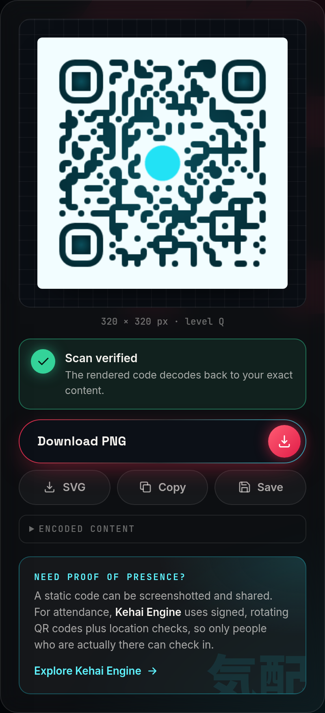 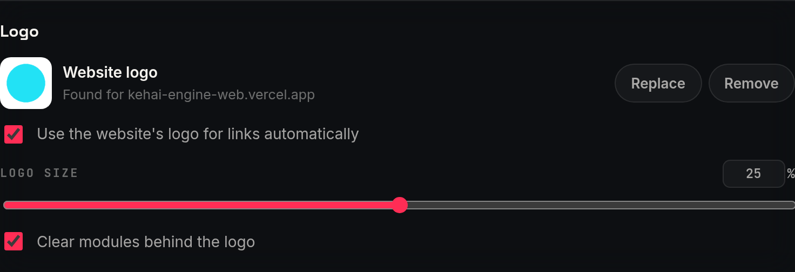</p>

**How it works** (`src/lib/siteLogo.ts`, `src/hooks/useSiteLogo.ts`):

1. **Wait for the link to settle.** Once the URL is valid and typing pauses (700 ms), the Studio takes its domain (e.g. `gdg.community.dev`).
2. **Ask public favicon services for its icon.** A browser can't read another site's HTML (CORS), and there's no backend, so the Studio asks public favicon services instead: Google's favicon service, then icon.horse, then DuckDuckGo. **Only the domain is sent**, never the path or query.
3. **Accept only safe, sharp images.** An image is used only if it:
   - arrives **with CORS headers** (otherwise drawing it would taint the canvas and break downloads and the scan check);
   - is a real image;
   - is at least **32 px** (tiny favicons look blurry when enlarged).
4. **Store it locally.** It's redrawn onto a 256 px canvas and stored as a **data: URL**, so exports and saved history never depend on the network again. Each domain is looked up once per visit.
5. **Keep the code scannable.** Adding it raises error correction to **High** (just like an uploaded logo), and the live scan check verifies the result.

**You stay in control:**

- **Remove:** the logo stays off for that site, and a one-click **"Use it again"** brings it back.
- **Replace:** upload your own logo. An uploaded logo always wins and is never overwritten by lookups.
- **Change site or type:** another site swaps in its logo; switching to a non-URL type clears it.
- **Turn it off:** a toggle, "Use the website's logo for links automatically", is remembered between visits. With it off, no lookup is ever made.
- **Fail silently:** if nothing suitable is found, the code is generated without a logo and the panel says so.

---

## Scan reliability, in detail

### 1. Live scan verification

About 250 ms after any change, the Studio does three things (`useScanCheck`, `src/lib/scanCheck.ts`):
1. Renders the PNG you would download.
2. Decodes it with [jsQR](https://github.com/cozmo/jsQR).
3. Compares the decoded bytes with the intended payload.

Decoding runs with inversion **off**, because most camera apps don't retry with inverted colours, so an inverted code shouldn't get a pass either.

| Badge | Meaning |
|---|---|
| ✅ **Scan verified** | Decodes to exactly your content and no readability rule is triggered |
| ⚠️ **Scans, with caveats** | Decodes correctly, but the design breaks a rule of thumb for real cameras |
| ❌ **Won't scan** / **Decodes to the wrong content** | The rendered image doesn't decode, or decodes to something else |

### 2. Readability analysis

A decoder reading a perfect digital image is far more forgiving than a phone camera at an angle in dim light.
So `src/lib/readability.ts` also applies static rules, each with a plain-English fix:

| Check | Rule |
|---|---|
| Contrast | WCAG contrast ratio between code and background: < 2:1 is an error, < 4:1 a warning. With a gradient, both ends are checked and the weakest one decides. |
| Inverted colours | A code lighter than its background is a warning, because many scanners only read dark-on-light. |
| Quiet zone | The margin is measured in modules as actually rendered: < 1 is an error, < 2 a warning. |
| Module size | Pixels per module: < 2 px is an error, < 3 px a warning. |
| Logo vs error correction | Logo area is compared with what the level can recover (L 7%, M 15%, Q 25%, H 30%). Adding a logo automatically raises the level to **H**. |
| Decorative modules | "Dots" / "Classy" patterns at level L or M trigger a warning to use Q or H. |
| Density / overflow | Very dense codes (version ≥ 15) get a warning. Content too long for any QR version is reported instead of crashing. |

<p align="center">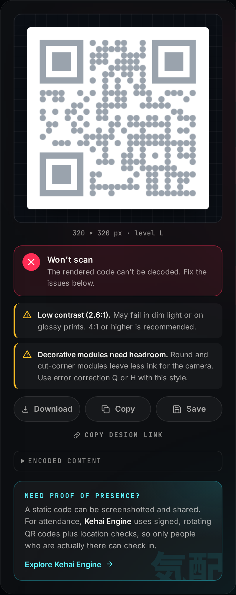</p>

---

## Screenshots

| Light theme · Wi-Fi | Logo + gradient |
|---|---|
| 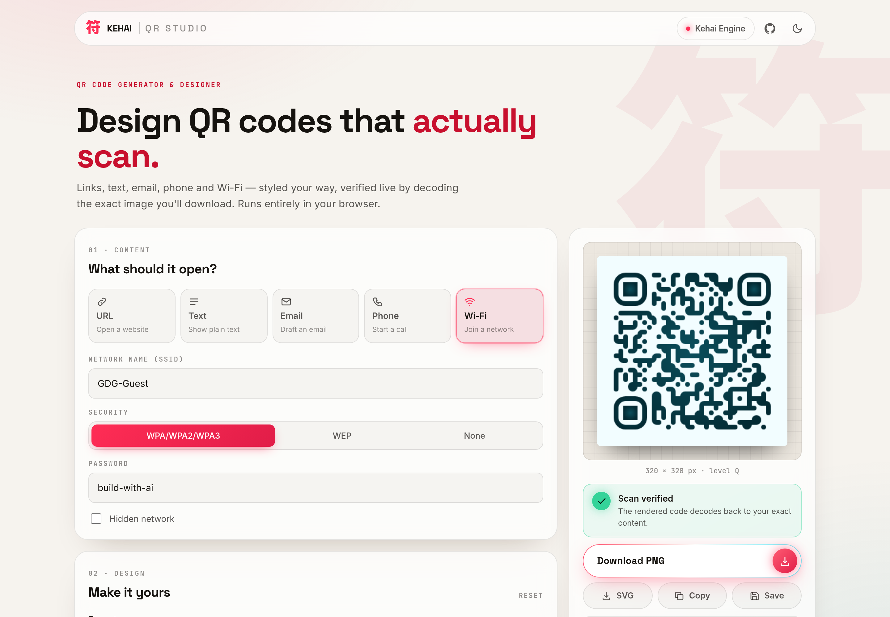 | 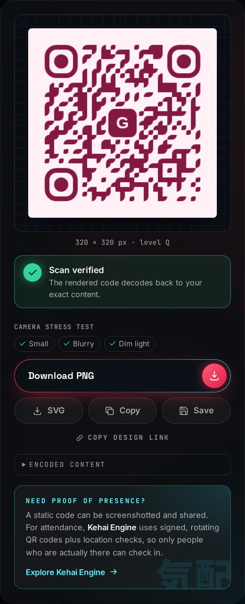 |

| Design panel | Validation |
|---|---|
| 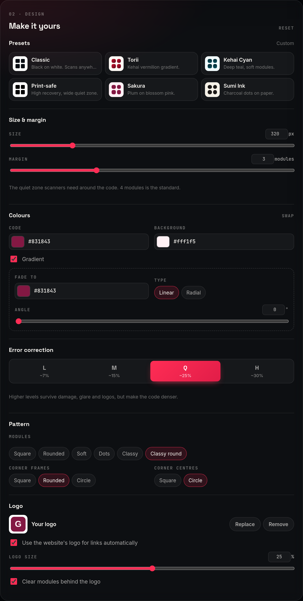 | 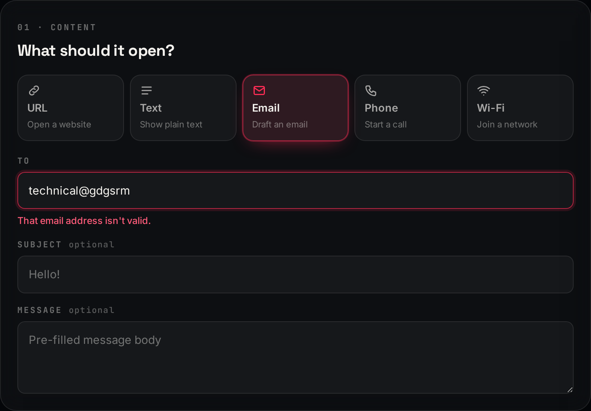 |

| Mobile | Mobile preview |
|---|---|
| 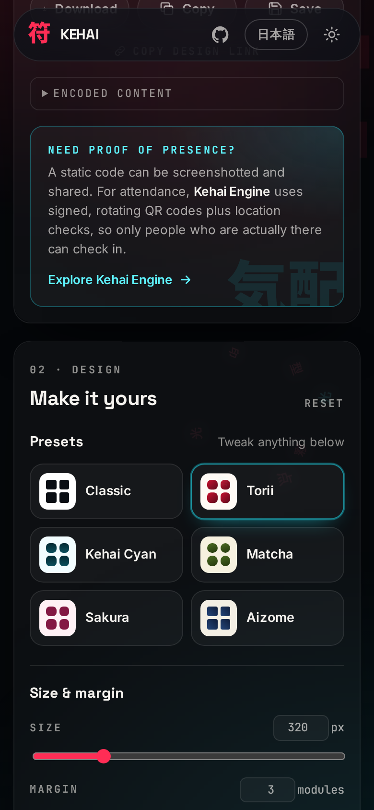 | 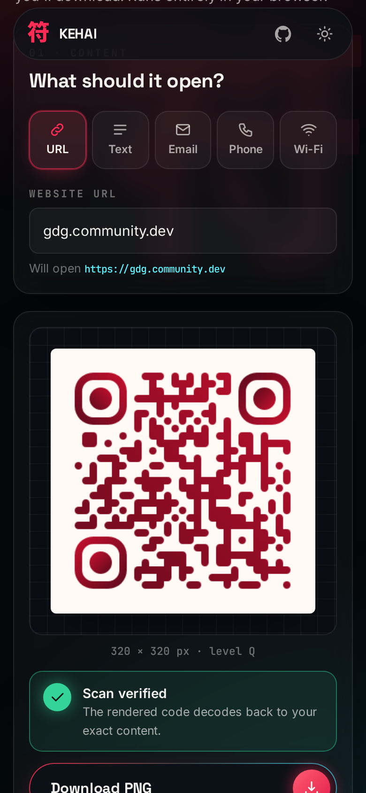 |

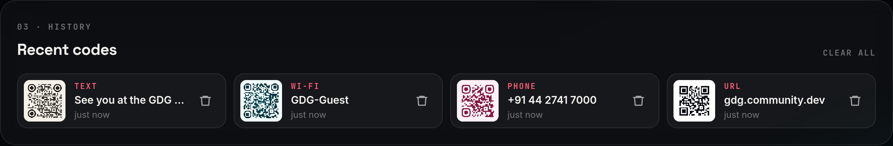

---

## Architecture

```
src/
├── lib/                    Pure logic: no React, fully unit-tested
│   ├── qrTypes.ts          Types, fields, validation, encoding (URL/text/email/phone/Wi-Fi)
│   ├── design.ts           Design model, presets, module-based margin, qr-code-styling options
│   ├── readability.ts      Contrast maths, geometry, readability rules
│   ├── scanCheck.ts        Decode rendered pixels with jsQR and compare with the payload
│   ├── history.ts          Recent-codes persistence (validation, de-dup, quota handling)
│   ├── siteLogo.ts         Website-logo lookup: domain extraction, favicon services, CORS/size checks
│   └── exporting.ts        Download, clipboard, thumbnails, file names
├── hooks/
│   ├── useQrRenderer.ts    Owns the single renderer instance (preview = export)
│   ├── useScanCheck.ts     Debounced live verification
│   ├── useRecent.ts        History state, synced across tabs
│   ├── useSiteLogo.ts      Auto-adds/removes the link's website logo; remove/restore/toggle
│   └── useTheme.ts         Dark/light theme, persisted, no flash on load
├── components/             ContentForm, DesignPanel, Preview, RecentList, KehaiCallout, …
└── App.tsx                 State wiring
e2e/                        Playwright: behaviour, responsive layout, README screenshots
```

**Data flow:** `fields → validate() → encode() → payload`, then `payload + design` feeds three things: the **renderer** (preview and export), **analyze()** (warnings) and **verifyScan()** (badge).
There is one source of truth for the design, so the preview, the downloaded PNG and the SVG can't drift apart.

**No backend.** Everything runs in the browser. Fonts are bundled rather than loaded from Google Fonts, and only the three kanji subsets the app actually uses are shipped. The **only** outside request is the optional website-logo lookup: it sends the link's domain name to a public favicon service, and it can be switched off.

---

## Design decisions

- **Margin in modules, not pixels.** QR scanners need a "quiet zone" measured in modules (the spec asks for 4). A pixel margin that's fine at 320 px disappears at 1024 px, which the test suite caught. The margin control is in modules and converted to pixels from the code's real grid, so it's correct at any size.
- **UTF-8 that actually works.** The renderer writes one byte per character, which corrupts accents, kanji and emoji. Payloads are converted to their UTF-8 bytes first. There's an end-to-end test for `こんにちは 🌸`.
- **Errors after interaction.** Validation messages appear once you leave a field, not while you're still typing the first character. Export stays disabled until the input is valid.
- **Presets set looks only.** Your size and logo survive a preset change, and anything can be tweaked afterwards.
- **Accessibility:** native radio groups for every choice (keyboard and screen-reader friendly), labelled controls, `aria-invalid` / `aria-describedby` for errors, live regions for the scan badge and toasts, visible focus rings, and reduced-motion support.

---

## Getting started

```bash
npm install
npm run dev          # http://localhost:5173
npm run build        # type-check + production build into dist/
npm run preview      # serve the production build
```

Requires Node 18+.

### Testing

```bash
npm test             # 76 unit + component tests (Vitest, jsdom)
npm run test:e2e     # 22 end-to-end tests in Chromium (desktop + Pixel 7)
npm run screenshots  # regenerate docs/screenshots
```

What the end-to-end suite verifies, in a real browser:

- **Every type** (URL, text including UTF-8/emoji, email, phone, Wi-Fi with special characters) is downloaded as PNG and **decoded back to the exact payload**.
- The **downloaded PNG is pixel-identical** to the preview.
- **Size, colours, error correction and margin** change the output immediately. Size and colour are checked in the downloaded file itself.
- **Presets** apply and stay editable. **Invalid input** shows errors and blocks export. **Risky designs** raise warnings.
- A **logo** raises error correction and still scans. **SVG export** is a valid SVG document.
- **Recent codes survive a reload** and restore type, content and preset. Removing and clearing work.
- The **theme** persists. On a **phone** there's no horizontal scrolling, the preview sits under the form, and all tabs are reachable.
- **Website logos:** the favicon services are stubbed with a generated image, so the tests never depend on the internet. The tests cover:
  - a link gets its site's logo automatically (verified in the centre pixel of the download), and the code still decodes;
  - only the domain is sent;
  - remove, "Use it again" and upload/replace work, and an upload is never overwritten;
  - another site swaps the logo, and a non-URL type clears it;
  - missing or too-small icons mean no logo;
  - the off switch is remembered and makes no requests at all.

---

## Deployment

It's a static site. On Vercel: import the repo, keep the detected **Vite** preset (build `npm run build`, output `dist`), and deploy. Netlify works the same way.

---

## Credits

- [qr-code-styling](https://github.com/kozakdenys/qr-code-styling) (MIT) for rendering, and [qrcode-generator](https://github.com/kazuhikoarase/qrcode-generator) (MIT) for module geometry
- [jsQR](https://github.com/cozmo/jsQR) (Apache-2.0) for decoding
- Inter, Space Grotesk, JetBrains Mono and Noto Sans JP (SIL OFL 1.1), via Fontsource

Built by **[Sushil Raj](https://github.com/SushilRaj0177)** for the GDG on Campus SRM technical recruitment (Frontend Task 1), as part of the Kehai ecosystem.
